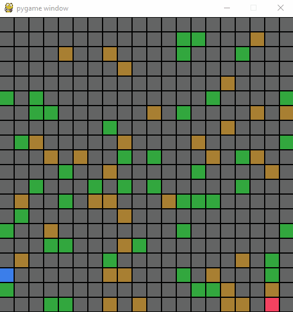

# Pathfinding

Small project for demonstrating how path finding is working with randomly distributed weighted cells (normal = 1, green = 2, brown = 3) and the possibility to draw walls before running the algorithm.

Currently implemented is the [Dijkstra algorithm](https://en.wikipedia.org/wiki/Dijkstra%27s_algorithm "Dijkstra Algorithm Wikipedia").

For displaying purpose I used the library pygame.

## Demo



## Requirements

``` A working python installation ```

## How to run 

```
git clone https://github.com/CaptainKappa/Pathfinding.git
cd Pathfinding
pip install pygame
py main.py
```
